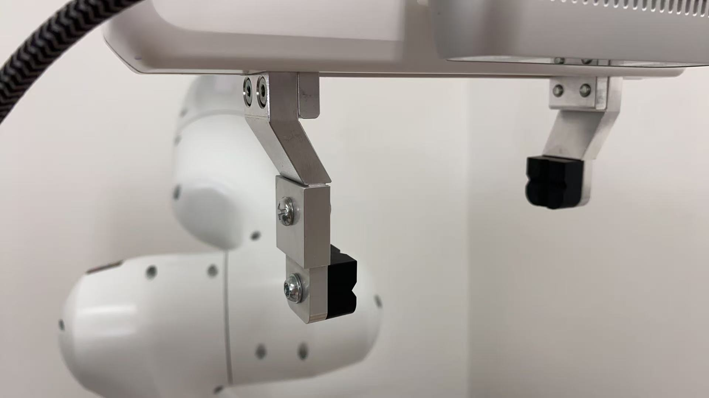
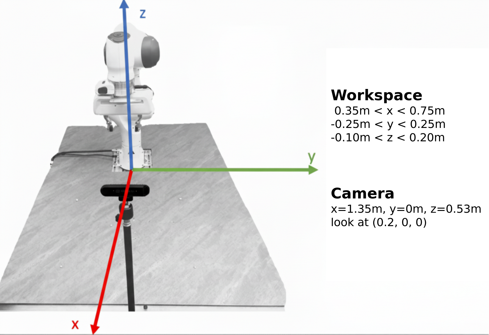

# Real World Controller for StereoVLA
This repository contains the client code used to control a Franka robot in the real world for StereoVLA. Model server code is [here](https://github.com/shengliangd/StereoVLA).

**⚠️ CAUTION:
Ensure that the emergency stop button is available. If the robot arm behaves abnormally, press the emergency stop immediately.**

## Hardware Requirements
- **Robot**: A Franka robot.
- **Cameras**: A ZED Mini stereo camera.
- **Workstation**: Tested on Ubuntu 20.04. NVIDIA GPU (e.g., 4090) is required by ZED SDK.

## Installation

1. Install docker (https://docs.docker.com/engine/install/);
2. Clone this repo and cd to it;
3. Download cuda with `wget -P ./deps https://developer.download.nvidia.com/compute/cuda/12.8.0/local_installers/cuda_12.8.0_570.86.10_linux.run`;
4. Download ZED SDK runfile: `ZED_SDK_Ubuntu20_cuda12.1_v4.2.5.zstd.run` from https://www.stereolabs.com/en-hk/developers/release/4.2;
5. Run `docker build . -t franka_ros_zed:latest`. **For earlier FER3 versions, add `-f Dockerfile_FER3`**;
6. Due to zed sdk's installation method, we have to manually install it into the docker image:
    ```bash
    docker run -it --rm -v "$(pwd)/deps:/mnt/deps" franka_ros_zed:latest bash
    # inside container:
    set +e
    adduser --disabled-password --gecos "" tmp && usermod -aG sudo tmp && passwd -d tmp
    sudo -u tmp bash /mnt/deps/ZED_SDK_Ubuntu20_cuda12.1_v4.2.5.zstd.run
    ```
   - The ZED installer prompts require interactive confirmation.

## Configuration
### Franka

1. **IP**: Set the environment variable `ROBOT_IP` to your franka desk ip with `export ROBOT_IP=<your_ip>`.

    Make sure your workstation ip and franka desk ip are in the same network (e.g., workstation ip = 172.16.0.1 and franka desk ip = 172.16.0.2). For details, see https://frankarobotics.github.io/docs/getting_started.html#setting-up-the-network.

2. **FCI Mode**: Visit franka desk in web browser, for example https://172.16.0.2/desk. In top right of the panel, click the `enable fci interface` button. For details, see https://frankarobotics.github.io/docs/getting_started.html#preparing-the-robot-for-fci-usage-in-desk.

3. **Extention of Fingers**: To grasp convex-shaped objects more firmly, we extend the original Franka fingers as shown in the figure below. However, our model works robustly with both the original and extended fingers, so you can choose either option based on your needs.

    - To use extensions: Print two copies of `res/extension.STEP` and install them.

      

### Camera
1. Connect a ZED Mini camera to your workstation. Note that ZED Mini is sensitive to the flip of the USB type-C cable, try flip and re-plug if the camera is not detected later.

2. While the released checkpoint is robust to a wide range of camera placement as described in our paper, for the first run it is suggested to place the camera to the reference pose below:

  

### Test Connection to the Model Server
1. Start the model server following the instructions in [StereoVLA Model Repo](https://github.com/shengliangd/StereoVLA).

2. Run the following command to validate the server is running. It will return ✓ if the server returns a valid result.

  ```bash
  docker compose run --rm validate_server --ip <your_server_ip> --port <your_server_port>
  ```

## Inference

To start inference, run the following commands:
```bash
xhost +
docker compose run --rm main --cameras zed --mode grasp --controller blocking --save-to ./experiments/test --server-ip <server_ip> --server-port <server_port> --robot-ip $ROBOT_IP --extended-finger <0_or_1>
```

* To verify the pipeline functionality, start by testing simple cases—like placing 4-5 objects near the center of workspace (x=0.5m, y=0m) on a clean table.

* When prompted, type the object name and press enter. The client will auto-complete the instruction as "pick up {object_name}".

* Keyboard controls during task execution: 

  - `p`: pause the robot
  
  - `q`: finish trajectory and reset to initial pose (opens gripper)

* Non-blocking mode:

  - Remember to run `docker compose down -t 0` before switching controller mode.

  - Use `--controller non-blocking`. 
  
  - The performance depends on the inference delay and network condition.

* Non-grasp instructions: replace `--mode grasp` with `--mode instruct`, then you can input free-form text instructions. Check [the model repo](https://github.com/shengliangd/StereoVLA) for supported instructions.

* Controller precision decreases near workspace edges, which may reduce success rates. Therefore, begin testing with objects positioned near the center of the workspace.

### Safety Features

- When the robot receives an external force larger than FORCE_LIMIT (default 15N), it will print `recovery: ...` and lift the gripper to avoid collision.

### Category List
We provide a list of categories we've tested in `res/category_list.txt`. You can start with these verified categories to test the correctness of the pipeline.

## Citation

If you found this repository useful, please consider to cite the following works:

- Our paper:
```bibtex
@misc{deng2025stereovlaenhancingvisionlanguageactionmodels,
      title={StereoVLA: Enhancing Vision-Language-Action Models with Stereo Vision}, 
      author={Shengliang Deng and Mi Yan and Yixin Zheng and Jiayi Su and Wenhao Zhang and Xiaoguang Zhao and Heming Cui and Zhizheng Zhang and He Wang},
      year={2025},
      eprint={2512.21970},
      archivePrefix={arXiv},
      primaryClass={cs.RO},
      url={https://arxiv.org/abs/2512.21970}, 
}
```

- Control Suite:
```bibtex
@misc{luo2025serlsoftwaresuitesampleefficient,
      title={SERL: A Software Suite for Sample-Efficient Robotic Reinforcement Learning}, 
      author={Jianlan Luo and Zheyuan Hu and Charles Xu and You Liang Tan and Jacob Berg and Archit Sharma and Stefan Schaal and Chelsea Finn and Abhishek Gupta and Sergey Levine},
      year={2025},
      eprint={2401.16013},
      archivePrefix={arXiv},
      primaryClass={cs.RO},
      url={https://arxiv.org/abs/2401.16013}, 
}
```

[](LICENSE)
